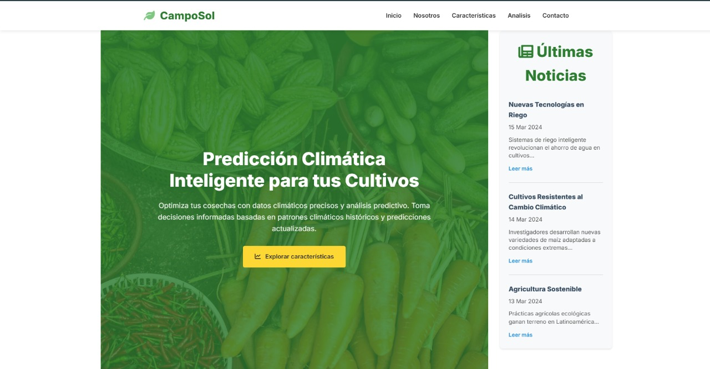

# 🌱 CampoSol - Plataforma para la Comunidad Agrícola

**CampoSol** es un sitio web informativo diseñado para brindar datos clave sobre una organización enfocada en el sector agrícola. Contiene secciones como presentación de la empresa, características de sus servicios, análisis del mercado y un formulario de contacto totalmente funcional.

> 🔗 [Ver el sitio en línea](https://fabianoriundo.github.io/tarea/)

---

## 📷 Capturas

- Página principal  
- Sección "Nosotros"  
- Características destacadas  
- Análisis gráfico  
- Formulario de contacto

---

## 🧭 Estructura del Sitio

- `index.html` – Página principal
- `nosotros.html` – Información sobre la empresa
- `caracteristicas.html` – Servicios y funciones
- `analisis.html` – Datos analíticos
- `contacto.html` – Formulario y redes sociales
- `styles.css` / `contacto.css` – Hojas de estilo
- `script.js` – Lógica del modo oscuro y validaciones

---

## 🛠️ Tecnologías Usadas

- HTML5 & CSS3
- JavaScript
- Google Fonts (Inter)
- Font Awesome
- Responsive Design (Diseño adaptable)
- Google Maps Embed

---

## 📬 Contacto y Soporte

Incluye una sección con:

- Dirección física de ejemplo
- Teléfonos y correos electrónicos
- Mapa interactivo de Google Maps
- Redes sociales (Facebook, Twitter, Instagram, LinkedIn)
- Formulario funcional con validación básica

---

## 🚀 Cómo ver el proyecto

Puedes ver el sitio web directamente en GitHub Pages:

🔗 https://fabianoriundo.github.io/tarea/

---

## 👨‍💻 Autores

- Rossana Vanessa Gutierrez Fasabi
- Fabian Misael Oriundo Lloclla
- Ricardo Inga Bellido
- José Manuel Paredes Zafra  
- Proyecto desarrollado en el marco del curso de **Ingeniería de Software con Inteligencia Artificial - SENATI**

---

## 📄 Licencia

Este proyecto es de uso académico y libre distribución con fines educativos.  
Puedes modificarlo, compartirlo y adaptarlo con atribución.

---

Gracias por visitar el sitio de **CampoSol** 🌿

